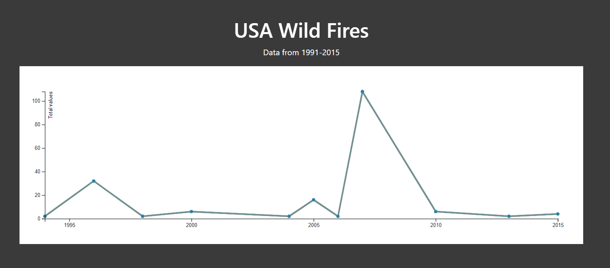

# d3-line-chart

Author:  Erin James Wills, ejw.data@gmail.com  

  
<cite>Photo by [Jack B](https://unsplash.com/@nervum?utm_source=unsplash&utm_medium=referral&utm_content=creditCopyText) on [Unsplash](https://unsplash.com/s/photos/candlestick-chart?utm_source=unsplash&utm_medium=referral&utm_content=creditCopyText)</cite>  

 

## Objective 

Fast demonstration of how to make a D3 line chart.
 
   

## Github Pages  

https://ejw-data.github.io/d3-line-chart

 

## Technologies    
*  HTML/CSS/JS
*  D3.js

 

## Data Source  
I believe the original dataset came from Kaggle.  

 

## Setup and Installation  
1. Clone the repo to your local machine
1. Open repo folder in an IDE like VSCode
1. Using a virtual server like the VSCode extention LiveServer
1. Run `index.html`  

 

## Example

 

